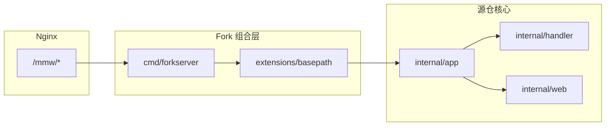

# Base URL 可插拔扩展（子路径反代）

> **迭代状态**：已实现（分支 `feat/basepath-extension`）  
> **关联计划**：Cursor Plan `BaseURL-82ee107b`  
> **源仓**：`iluobei/miaomiaowu` — 本能力为下游 fork 扩展，不向上游强耦合

## 目录

- [背景与目标](#背景与目标)
- [架构总览](#架构总览)
- [目录与职责](#目录与职责)
- [配置：BASE_PATH 默认 mmw](#配置base_path-默认-mmw)
  - [`.env` 模板（与 sub-web 对齐）](#env-模板与-sub-web-对齐)
- [后端设计](#后端设计)
- [前端设计](#前端设计)
- [Nginx / NPM 配置](#nginx--npm-配置)
- [与源仓同步](#与源仓同步)
- [验证清单](#验证清单)
- [实施顺序](#实施顺序)
- [风险与边界](#风险与边界)

## 背景与目标

### 问题

当前版本**不支持**可配置的 Base URL。路由与 API 均假定挂在站点根路径 `/`：

- 后端：`/api/*`、短链、`/t/{id}` 等注册在根路径（见 `cmd/server/main.go`）
- 前端：TanStack Router 使用 `/login`、`/users` 等绝对路径；`api.ts` 默认 `window.location.origin` + `/api`

若用 Nginx **子路径**反代（如 `https://nas.example.com/mmw/`），会出现页面 404、API 打到 `/api` 而非 `/mmw/api`、Clash 订阅链断裂等问题。

### 目标

- 支持子路径部署：`https://{域名}/mmw/` 下页面、API、短链、临时订阅均可访问
- **扩展与组合**：逻辑集中在 `extensions/`、`fork/`，源仓仅保留极薄挂钩（`internal/app`、`internal/publicpath`）
- **可同步上游**：合并 `iluobei/miaomiaowu` 时冲突面可控
- **默认子路径 `/mmw`**：fork 构建开箱即用，Nginx 用 `/mmw/` 区分服务，**无需用户改配置**
- **主配置为 `BASE_PATH`**（默认 `/mmw`）；项目内部拼接 API/订阅/短链路径；仅在有需要时可选覆盖对外域名

### 非目标（首版）

- 同域名多实例路径自动发现
- 仅依赖 `X-Forwarded-Host` 推断订阅外链（易静默失败）
- 修改源仓全部 handler 的路径字符串

## 架构总览



**请求路径（子路径模式）**：

1. 客户端请求 `https://domain/mmw/api/login`
2. Nginx 将带前缀的请求转发到容器
3. `extensions/basepath` 中间件 `StripPrefix(/mmw)` 后，内核仍按 `/api/login` 处理
4. 生成对外路径时使用 `publicpath.Join` 自动带上 `/mmw` 前缀；完整绝对 URL 仅在可选配置对外域名时拼接

### 与源仓同步策略

| 策略 | 含义 | 合并冲突 | 维护成本 |
| --- | --- | --- | --- |
| **A：极薄挂钩（采用）** | 新增 `internal/app`、`internal/publicpath`；fork 用 `cmd/forkserver` 组合 `extensions/basepath` | 可能冲突 `cmd/server/main.go`、`internal/app/*` | 低；脚本同步 `main.go` → `internal/app` |
| B：源仓零改动 | 独立网关或 `git apply` 补丁 | 源仓文件无冲突 | 补丁易失效 |

## 目录与职责

```
extensions/
  basepath/                 # Go：中间件、配置、对外 URL
    config.go               # BASE_PATH 默认 /mmw；可选 PUBLIC_ORIGIN
    middleware.go           # StripPrefix、X-Forwarded-Prefix
    rewrite.go              # Location、订阅 YAML URL 修正
    compose.go              # Wrap(rootHandler)
  frontend/
    paths.ts                # withBase、appOrigin、apiBaseURL
    api-shim.ts             # axios 包装
    router-shim.tsx         # createRouter basepath
    vite.config.fork.mts
    main.fork.tsx

fork/
  cmd/forkserver/main.go    # 启动：app + basepath.Wrap
  docker/
    Dockerfile.fork
    docker-compose.fork.yml
  docs/
    nginx-subpath.example.conf
    UPSTREAM-SYNC.md

internal/
  app/                      # 从 cmd/server/main.go 抽取的装配
  publicpath/               # URL 门面（默认 no-op）

scripts/
  sync-app-from-upstream.sh
  build-fork.sh
```

**原则**：`extensions/`、`fork/` 为下游自有目录；合并源仓时通常**无冲突**。

## 配置：BASE_PATH 默认 mmw

### `.env` 模板（与 sub-web 对齐）

**勿提交 `.env`**（已 gitignore）。仓库根目录提供可提交模板：

| 文件 | 场景 | 【必改】项数 |
| --- | --- | --- |
| `.env.default` | 源仓根路径 + `build.sh` | **0** |
| `.env.example` | Fork `/mmw/` + `build-fork.sh` | **0**（默认即可 build）；换前缀时 **2** 项 |
| `.env.production.example` | 指向上述两份文件的说明 | — |

```bash
cp .env.example .env          # Fork 子路径（默认 /mmw/，一般不用改）
./scripts/build-fork.sh

cp .env.default .env          # 源仓根路径
./build.sh
```

文件内用 **【必改】/【可改】/【沿用默认·不必改】** 标注。构建时 Vite 从仓库根 `.env` 读取 `VITE_BASE_PATH`；容器运行时从环境变量读取 `BASE_PATH`（`docker-compose` 可用 `env_file: ../../.env`）。

| 变量 | 生效阶段 | 说明 |
| --- | --- | --- |
| `VITE_BASE_PATH` | **前端构建** | 如 `/mmw/`，须以 `/` 结尾 |
| `BASE_PATH` | **后端运行** | 如 `/mmw`，无末尾 `/` |
| `PUBLIC_ORIGIN` | **后端运行** | 可选，仅 scheme+host |

换前缀时 **须同时改** `BASE_PATH` 与 `VITE_BASE_PATH`，并重建前端 + 调整 Nginx。

### 为何用 BASE_PATH，而不是让用户填 PUBLIC_URL？

| 概念 | 职责 |
| --- | --- |
| **`BASE_PATH`（路径前缀）** | Nginx 区分服务、StripPrefix、前端 Router/Vite、YAML 里的 `/mmw/api/...` —— **fork 默认 `/mmw`，零配置** |
| **`PUBLIC_ORIGIN`（可选）** | 仅 scheme + host，如 `https://nas.example.com`；用于管理页复制「完整外链」、或内外网域名与浏览器不一致时 |

用户只需理解：**服务挂在 `/mmw` 下**（默认值，与 Nginx `location /mmw/` 一致）。  
完整 URL 由代码拼接：`PUBLIC_ORIGIN`（有则用，无则浏览器用当前 origin）+ `BASE_PATH` + `/api/...`。

不叫 `PUBLIC_URL` 作主配置的原因：路径前缀与对外域名是两层信息；默认场景只要路径，域名跟当前访问一致即可。

### 默认值（fork 构建，无需用户修改）

| 项 | 默认值 |
| --- | --- |
| `BASE_PATH` | **`/mmw`**（代码内置；不设环境变量即生效） |
| `PUBLIC_ORIGIN` | 不设置（用请求头 / 浏览器 `location.origin`） |
| Vite `base` | **`/mmw/`**（`.env.example` 中 `VITE_BASE_PATH`，与 `BASE_PATH` 一致） |
| Nginx 示例 | `location /mmw/` → 容器（文档与 compose 均按此约定） |

用户 **不需要** 为默认部署改 `.env` 或 compose；只有改前缀或固定公网域名时才覆盖环境变量。

### 环境变量

| 变量 | 必填 | 默认（fork） | 说明 |
| --- | --- | --- | --- |
| `BASE_PATH` | 否 | `/mmw` | 路径前缀；设为 `/` 或空则关闭子路径（等同源仓根路径） |
| `PUBLIC_ORIGIN` | 否 | （空） | 可选，`https://域名`（**不含**路径）；与 `BASE_PATH` 拼接为完整外链 |
| `PORT` | 否 | `8080` | 监听端口 |

**不再使用** `PUBLIC_URL` 作为主配置名（易与「完整 URL」混淆）。若实现层保留兼容别名，文档只推荐 `BASE_PATH` + `PUBLIC_ORIGIN`。

### 内部拼接规则（`internal/publicpath`）

```go
// 路径：始终带 BASE_PATH
Join("api", "proxy-provider", "1")  →  "/mmw/api/proxy-provider/1"

// 绝对 URL：仅当需要完整外链时
AbsURL("/api/proxy-provider/1?token=x")
  → PUBLIC_ORIGIN + "/mmw/api/proxy-provider/1?token=x"   // 若配置了 PUBLIC_ORIGIN
  → 或请求上下文中 scheme+host + "/mmw/api/..."          // 处理 HTTP 时
  → 或仅返回 Join(...) 写入 YAML（/mmw/api/... 对 Clash 已从站点根解析正确）
```

**订阅修复要点**：把现有 `/api/proxy-provider/{id}` 改为 `publicpath.Join("api", "proxy-provider", id)` → `/mmw/api/proxy-provider/{id}`。  
Clash 解析 `https://{Host}/mmw/api/...` 正确，**不强制**用户配置 `PUBLIC_ORIGIN`。

### 何时才需要改配置？

| 需求 | 配置 |
| --- | --- |
| 默认 NAS + Nginx `/mmw/` | **不用改** |
| 换成 `/other/` 前缀 | `.env` 中改 `BASE_PATH` + `VITE_BASE_PATH` + 重建 fork 前端 + 改 Nginx location |
| 内网管理、Clash 用公网域名订阅 | `PUBLIC_ORIGIN=https://公网域名`（路径仍由 `BASE_PATH` 拼接） |
| 与源仓一致的根路径部署 | 源仓 `build.sh` / 不设 `BASE_PATH` 或 `BASE_PATH=/` |

## 后端设计

### 1. 抽取 `internal/app`

将 `cmd/server/main.go` 中 mux 注册、后台任务、`ListenAndServe` 迁至 `internal/app/run.go`：

- `func NewHandler(...) http.Handler`
- `func Run(ctx, cfg) error`

源仓 `cmd/server/main.go` 瘦身为调用 `app.Run`（便于未来向上游提 PR）。fork 生产构建使用 `cmd/forkserver/main.go`。

合并源仓后执行：`scripts/sync-app-from-upstream.sh`。

### 2. `internal/publicpath`

```go
func Join(elem ...string) string      // 默认 Prefix="" 与现网一致
func AbsURL(pathAndQuery string) string
func PublicOrigin() string
```

挂钩点（约 5 处，不扩散全仓库）：

- `internal/handler/proxy_provider.go` — 生成 proxy-provider URL
- `internal/handler/subscription.go` — 内部 API URL 识别与输出修正
- 短链相关 handler（若有完整 URL 返回）

fork 启动：`publicpath.SetProvider(basepath.NewProvider(cfg))`。

### 3. `extensions/basepath`

| 能力 | 实现 |
| --- | --- |
| 入站 | `http.StripPrefix(BASE_PATH, next)`；默认 `/mmw` |
| 出站 | 包装 `ResponseWriter`，修正 `Location` |
| 组合 | `basepath.Wrap(h, cfg)` 包在 `http.Server` 最外层 |

### 4. Fork 入口

```go
h := app.NewHandler(...)
http.ListenAndServe(addr, basepath.Wrap(h, basepath.FromEnv()))
```

`BASE_PATH` 为空或 `/` 时行为与现网根路径部署一致；fork 默认非空。

## 前端设计

### Fork 专用构建

- 入口：`extensions/frontend/main.fork.tsx`（设置 router `basepath` 后加载原应用）
- 配置：`extensions/frontend/vite.config.fork.mts`
  - `base` 来自 `VITE_BASE_PATH`（`.env` / `.env.example`，默认 `/mmw/`）
  - alias：`@/lib/api` → `api-shim.ts`
- 默认 `npm run build`（源仓）不变；下游使用 `scripts/build-fork.sh`

### 路径工具 `paths.ts`

- `withBase('/login')` → `/mmw/login`
- `appOrigin()` — 替代 scattered `window.location.origin`
- `apiBaseURL()` — 与 axios 一致

需替换约 **7 处** `window.location.origin`（`subscribe-files.index.tsx`、`generator.tsx`、`nodes.index.tsx` 等）及 `api.ts` 中硬编码跳转。

## Nginx / NPM 配置

```nginx
location /mmw/ {
    proxy_pass http://127.0.0.1:8080/mmw/;
    proxy_set_header Host $host;
    proxy_set_header X-Forwarded-Prefix /mmw;
    proxy_set_header X-Forwarded-Proto $scheme;
}
```

Docker Compose 示例：

```yaml
# 默认可不写 environment；以下为可选覆盖示例
# environment:
#   - BASE_PATH=/mmw
#   - PUBLIC_ORIGIN=https://你的公网域名
```

完整示例见实现后的 `fork/docs/nginx-subpath.example.conf`。

## 与源仓同步

详见 `fork/docs/UPSTREAM-SYNC.md`（实现阶段编写）。摘要：

1. `git fetch upstream && git merge upstream/main`
2. 冲突预期：`cmd/server/main.go`、`internal/app/*`
3. `scripts/sync-app-from-upstream.sh`
4. `scripts/build-fork.sh` + 子路径冒烟测试

## 验证清单

| 项 | 期望 |
| --- | --- |
| fork 默认（无 env） | `BASE_PATH=/mmw`，Nginx `/mmw/` 即可用 |
| `BASE_PATH=/` | 与源仓根路径一致 |
| Clash 订阅 | YAML 内路径为 `/mmw/api/proxy-provider/...`（或带 `PUBLIC_ORIGIN` 的完整 URL） |
| 改 `PUBLIC_ORIGIN` | 复制/外链显示固定公网域名，路径仍为 `/mmw/...` |
| 短链 | `https://domain/mmw/{code}` 可访问 |
| 临时订阅 | `/mmw/t/{8位}` 可访问 |
| 合并源仓小版本 | `sync-app-from-upstream.sh` 可完成 |

## 实施顺序

| 步骤 | 内容 |
| --- | --- |
| 1 | 拉分支 `feat/basepath-extension` |
| 2 | 抽取 `internal/app`，瘦身 `cmd/server/main.go` |
| 3 | `extensions/basepath` + `internal/publicpath` + `cmd/forkserver` |
| 4 | 后端约 5 处对外 URL + 中间件 |
| 5 | `extensions/frontend` + `build-fork.sh` + `Dockerfile.fork` |
| 6 | 前端 `origin` / 跳转集中替换 |
| 7 | `UPSTREAM-SYNC.md`、Nginx 示例 |
| 8 | 本地与 QNAP 子路径联调 |

## 风险与边界

- **QNAP Container Station「浏览 / 复制访问路径」** 仅根据 `8080:8080` 生成 `http://<IP>:8080/`，**不会**带上 `/mmw/`（平台不知道 `BASE_PATH`）。fork 已在根路径 `/` 做 **302 → `/mmw/`**，直接点「浏览」也会进应用；复制链接请用 **`http://<IP>:8080/mmw/`** 或 NPM 反代后的 `https://域名/mmw/`。
- 浏览器内 API 必须知道子路径前缀；通过 fork 构建链隔离，不污染源仓默认构建。
- 源仓大改 `main.go` 时，`internal/app` 需人工审阅合并结果。
- 禁止对响应 JSON 做全局 `/api/` 字符串替换，易误伤；仅对已知字段使用 `publicpath`。
- 内网 IP 管理、公网域名订阅不一致时，设置 `PUBLIC_ORIGIN` 为 Clash 实际使用的公网域名（无需改 `BASE_PATH`）。
